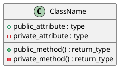
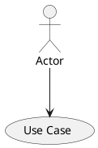
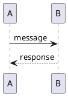

# ZAI E-commerce Platform - PlantUML Diagrams

This directory contains PlantUML diagram files converted from the original StarUML diagrams for the ZAI E-commerce Platform project. These diagrams provide a comprehensive view of the system architecture, use cases, class structures, and sequence flows.

## 📁 Diagram Files Overview

### Class Diagrams

#### 1. `plantuml_global_class_diagram.puml`
**Global System Class Diagram**
- **Classes**: User, Product, Order, Cart, Category, Ticket
- **Purpose**: Shows the overall system structure and relationships
- **Key Features**:
  - User management with roles and authentication
  - Product catalog with categories
  - Shopping cart functionality
  - Order processing system
  - Support ticket system

#### 2. `plantuml_authentication_class_diagram.puml`
**Authentication Module (Sprint 1)**
- **Classes**: AuthController, UserModel, SessionManager, DolibarrIntegration
- **Purpose**: Detailed view of authentication and user management
- **Key Features**:
  - User registration and login
  - Session management
  - Password security
  - Dolibarr ERP integration

#### 3. `plantuml_product_catalog_class_diagram.puml`
**Product Catalog Module (Sprint 2)**
- **Classes**: ProductController, ProductModel, CategoryModel, CartController, CartModel
- **Purpose**: Product browsing and cart management
- **Key Features**:
  - Product display and search
  - Category management
  - Shopping cart operations
  - Inventory tracking

#### 4. `plantuml_orders_support_class_diagram.puml`
**Orders & Support Module (Sprint 3)**
- **Classes**: OrderController, OrderModel, PaymentService, TicketController, TicketModel, EmailService
- **Purpose**: Order processing and customer support
- **Key Features**:
  - Order creation and management
  - Payment processing
  - Support ticket system
  - Email notifications

### Use Case Diagrams

#### 5. `plantuml_global_usecase_diagram.puml`
**Global System Use Cases**
- **Actors**: Customer, Administrator, Visitor
- **Use Cases**: Registration, Product browsing, Cart management, Order placement, Support
- **Purpose**: High-level view of system functionality

#### 6. `plantuml_authentication_usecase_diagram.puml`
**Authentication Use Cases (Sprint 1)**
- **Actors**: Visitor, Customer, Administrator
- **Use Cases**: Register, Login, Logout, Reset Password, Profile Management
- **Purpose**: User authentication and account management flows

#### 7. `plantuml_product_catalog_usecase_diagram.puml`
**Product Catalog Use Cases (Sprint 2)**
- **Actors**: Visitor, Customer, Administrator
- **Use Cases**: Browse Products, Search, Add to Cart, Manage Products
- **Purpose**: Product discovery and cart management flows

#### 8. `plantuml_orders_support_usecase_diagram.puml`
**Orders & Support Use Cases (Sprint 3)**
- **Actors**: Customer, Support Agent, Administrator, Payment Gateway
- **Use Cases**: Create Order, Process Payment, Track Order, Support Tickets
- **Purpose**: Order processing and customer support flows

### Sequence Diagrams

#### 9. `plantuml_sequence_diagrams.puml`
**Core System Sequences**
- **User Registration Sequence**: Complete registration flow with Dolibarr integration
- **User Login Sequence**: Authentication and session management
- **Product Display Sequence**: Product browsing and category navigation
- **Add to Cart Sequence**: Shopping cart operations

#### 10. `plantuml_order_support_sequences.puml`
**Order & Support Sequences**
- **Order Creation Sequence**: Complete order processing flow
- **Support Ticket Creation Sequence**: Customer support ticket creation
- **Order Tracking Sequence**: Order status and tracking information

## 🚀 How to Use These Diagrams

### Prerequisites
1. **PlantUML**: Install PlantUML or use online editor
2. **Java**: Required for local PlantUML rendering
3. **IDE Plugin**: VS Code PlantUML extension or similar

### Viewing Diagrams

#### Option 1: Online PlantUML Editor
1. Visit [PlantUML Online Server](http://www.plantuml.com/plantuml/uml/)
2. Copy and paste the content of any `.puml` file
3. Click "Submit" to generate the diagram

#### Option 2: VS Code with PlantUML Extension
1. Install "PlantUML" extension in VS Code
2. Open any `.puml` file
3. Press `Alt + D` to preview the diagram
4. Use `Ctrl + Shift + P` → "PlantUML: Export Current Diagram" to save as image

#### Option 3: Local PlantUML Installation
```bash
# Install PlantUML (requires Java)
java -jar plantuml.jar diagram_file.puml

# Generate PNG
java -jar plantuml.jar -tpng diagram_file.puml

# Generate SVG
java -jar plantuml.jar -tsvg diagram_file.puml
```

### Editing Diagrams

#### Class Diagrams


#### Use Case Diagrams


#### Sequence Diagrams


## 🏗️ System Architecture Overview

### Sprint 1: Authentication Foundation
- User registration and login system
- Session management
- Dolibarr ERP integration
- Security implementation

### Sprint 2: Product Catalog
- Product display and categorization
- Search functionality
- Shopping cart management
- Inventory integration

### Sprint 3: Orders & Support
- Order processing workflow
- Payment gateway integration
- Customer support system
- Email notifications

## 🔧 Technical Implementation Notes

### Dolibarr Integration
- **API Endpoints**: User synchronization, product catalog, order management
- **Data Flow**: Bidirectional sync between ZAI platform and Dolibarr ERP
- **Authentication**: API key-based authentication with Dolibarr

### Security Features
- **Password Hashing**: Secure password storage
- **Session Management**: Secure session handling
- **Input Validation**: Data validation and sanitization
- **CSRF Protection**: Cross-site request forgery prevention

### Database Design
- **User Management**: Users, roles, sessions
- **Product Catalog**: Products, categories, inventory
- **Order System**: Orders, order items, payments
- **Support System**: Tickets, messages, attachments

## 📊 Diagram Relationships

```
Global Diagrams (Overview)
├── Authentication Module (Sprint 1)
├── Product Catalog Module (Sprint 2)
└── Orders & Support Module (Sprint 3)
    └── Sequence Diagrams (Detailed Flows)
```

## 🎯 Usage Recommendations

1. **Start with Global Diagrams**: Get overall system understanding
2. **Review Sprint-specific Diagrams**: Understand module details
3. **Study Sequence Diagrams**: Learn interaction flows
4. **Use for Development**: Reference during implementation
5. **Update as Needed**: Modify diagrams when system changes

## 📝 Notes

- All diagrams follow PlantUML syntax and best practices
- Diagrams are organized by development sprints
- Each diagram includes detailed class attributes and methods
- Sequence diagrams show complete interaction flows
- Integration points with Dolibarr ERP are clearly marked

## 🔗 Related Files

- `staruml_diagrams.mdj`: Original StarUML project file
- `README_StarUML_Diagrams.md`: StarUML diagrams documentation
- Project documentation and implementation files

---

**Generated from StarUML diagrams for the ZAI E-commerce Platform project**  
**PlantUML Format - Ready for development and documentation use**